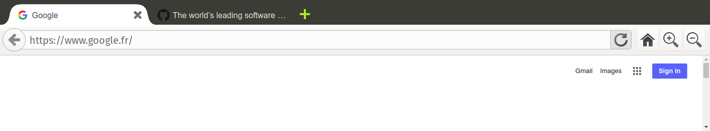

Browser-component
=================

*Browser component* is a web component designed to get a browser into the browser itself. It can be used to extend a headless browser, or give some more features to a web application, such as *firefox/xulrunner* or *chrome/chromium apps*. This project comes with sub components, to let you customize the browser of your wish.



## Overview

Get it directly by cloning this repository:

```bash
git clone https://github.com/jokesterfr/browser-component.git
```

Or use bower:

```bash
bower install browser-component
```

Import it in your page like so:

```html
<link rel="import" href="./bower_components/browser-component/dist/browser-component.html" />
```

And use it:

```html
<browser-component defaultPage="https://github.com">
  <browser-tabbar>
    <browser-tab url="https://www.laquadrature.net/en"></browser-tab>
    <browser-tab url="http://lestrans.com"></browser-tab>
    <browser-tab-new></browser-tab-new>
  </browser-tabbar>
  <browser-toolbar>
    <browser-navigation></browser-navigation>
    <browser-location></browser-location>
    <browser-button type="home"></browser-button>
    <browser-button type="zoom-in"></browser-button>
    <browser-button type="zoom-out"></browser-button>
  </browser-toolbar>
</browser-component>
```

## Testing example

If you want to test this component in a [chrome app](https://developer.chrome.com/apps/about_apps) context, simply type:

```bash
npm run example
```

## Browser compatibility

As of today, web components are not natively supported by Firefox,
Chrome and chromium support web components since version 35.

[Check browser compatibility](http://caniuse.com/#feat=shadowdom).

This `browser-component` uses the chrome [webview](https://developer.chrome.com/apps/tags/webview) tag. A tweak could be made to use the equivalent [XUL browser](https://developer.mozilla.org/en-US/docs/Mozilla/Tech/XUL/browser) tag, to be supported by Firefox. Therefore, the lack of Web components support does not urge me to do so.

## Components API

### browser-component

```html
<browser-component defaultPage="https://github.com">
  <!-- y mucho mas aqui -->
</browser-component>
```

The browser component is the key element of this package. Its main role is to deal with multiple *webview*s, masking states that does not rely on the selected tab / webview.

#### Attributes

* __defaultPage__ the default page to go when a tab with no url is opened, or when the home button is pressed. Defaults to *null*.
* __controls__ when the value is "hidden", no controls will be displayed on screen, fullscreen browsing is activated. Defaults to "visible".

#### Methods

* __go(uri)__ tells the current tab to go to this uri
* __goHome()__ tells the current tab to go to the home page (@see *defaultPage*)
* __zoomIn()__ zoom in the current tab
* __zoomOut()__ zoom out the current tab
* __stop()__ stop loading the current tab
* __reload()__ reload the current tab
* __back()__ tells the current tab to go back to last page in history
* __forward()__ tells the current tab to go forward to the next page in history
* __canGoBack()__ return true if the current tab can go back
* __canGoForward()__ return true if the current tab can go forward
* __showControls()__ displays the browser top controls
* __hideControls()__ hides the browser top controls

### browser-tabbar

The browser tabbar will display all tabs you filled in, you can use the selected attribute to choose the default tab to be selected (or the last one will be by default):

```html
<browser-tabbar>
  <browser-tab url="https://www.laquadrature.net/en"></browser-tab>
  <browser-tab url="http://lestrans.com"></browser-tab>
  <browser-tab-new></browser-tab-new>
</browser-tabbar>
```

There is no methods nor attributes to use with `<browser-tabbar>`.

### browser-tab

<browser-tab url="http://lestrans.com"></browser-tab>

A nice favicon and title are automatically added there. The actual behaviour is that a single tab in the tabbar cannot be closed. Also, only active tabs can be closed.

#### Attributes

* __url__: URL of the content to browse

#### Methods

* __select__: selects this tab (to use the corresponding *webview*)
* __close__: closes the tab (and the corresponding *webview*)

### browser-tab-new

```html
<browser-tab-new></browser-tab-new>
```

Allows you to dynamically add some more tabs. To be placed right after the `<browser-tab>` element(s).

### browser-tab-separator

```html
<browser-tab></browser-tab>
<browser-tab-separator></browser-tab-separator>
<browser-tab></browser-tab>
```

A graphical separation between tabs.

### browser-toolbar

You may place buttons or location fields in it, feel free to suggest any other components you would like to use here.

```html
<browser-toolbar>
  <browser-navigation></browser-navigation>
  <browser-location></browser-location>
  <browser-button type="home"></browser-button>
  <browser-button type="zoom-in"></browser-button>
  <browser-button type="zoom-out"></browser-button>
</browser-toolbar>
```

### browser-button

```html
<browser-button type="zoom-in"></browser-button>
```

A simple button, customizable with any icon of your wish:

* __back__
* __bookmark__
* __download__
* __feed__
* __forward__
* __history__
* __home__
* __menu__
* __new-window__
* __print__
* __reload__
* __zoom-in__
* __zoom-out__
* __zoom__

Feel free to PR a new one.
Actions are triggered by the `<browser-button>` parent.

### browser-navigation

```html
<browser-navigation></browser-navigation>
```

This component is made of a back button and a forward button. The forward button disappear when there is no next page in the browsing history. States are related to current tab. Simple.

### browser-location

```html
<browser-location></browser-location>
```

The input which let you choose how to browse the web! Comes with a go/reload button on its right.

# Licence

This work is largely inspired by Firefox [Australis UI](http://people.mozilla.org/~shorlander/files/australis-linux-svg-test/australis-liveDemo-linux.html), therefore the same licence applies here:

[Mozilla Public License - Version 2.0](https://www.mozilla.org/MPL/2.0/)
